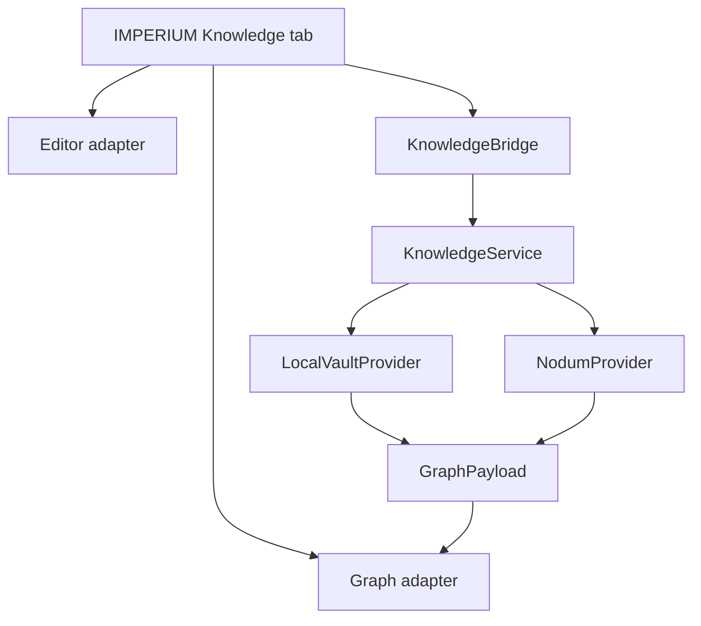

# Cognitio target architecture

## Ownership boundary

| Layer | Owner | Responsibilities |
|---|---|---|
| Desktop shell | IMPERIUM | PyQt6 process, QWebEngine, tabs, lifecycle, preferences |
| Knowledge composition | IMPERIUM | React route, panes, commands, theme, navigation |
| Editor package | Cognitio web | Atomic-derived CodeMirror editor behind an adapter |
| Graph package | Cognitio web | Nodum-derived Cosmos.gl visualization behind typed props |
| Bridge | IMPERIUM + Cognitio API | Versioned QWebChannel messages and events |
| Knowledge service | Cognitio | Use cases, validation, conflicts, query coordination |
| Local provider | Cognitio | Markdown, SQLite/FTS, watcher, backlinks, graph algorithms |
| Remote provider | Cognitio | Optional Nodum REST adapter |

## Runtime shape



Only one provider is authoritative for a vault at a time.

## Core data contracts

```ts
export interface GraphNode {
  id: string;
  title: string;
  path?: string;
  kind: "note" | "goal" | "habit" | "course" | "flashcard" | "quiz" | "file" | "ghost";
  degree: number;
  unresolved?: boolean;
  tags: string[];
  createdAt?: string;
}

export interface GraphPayload {
  schemaVersion: 1;
  nodes: GraphNode[];
  edges: Array<[number, number]>;
  center?: string;
  truncated?: boolean;
}
```

```python
class KnowledgeProvider(Protocol):
    def list_notes(self, query: NoteQuery) -> Page[NoteSummary]: ...
    def read_note(self, note_id: str) -> NoteDocument: ...
    def save_note(self, command: SaveNote) -> SaveResult: ...
    def search(self, query: SearchQuery) -> SearchResult: ...
    def graph(self, query: GraphQuery) -> GraphSnapshot: ...
    def backlinks(self, note_id: str) -> tuple[Backlink, ...]: ...
```

## Source of truth

Local mode:

```text
Markdown files -> parser -> derived SQLite/FTS index -> graph/query responses
```

Remote mode:

```text
Nodum server -> NodumProvider -> normalized responses -> IMPERIUM UI
```

The local SQLite database is never the only copy of user-authored prose. Provider identity, vault ID, note ID, revision, and schema version must be present in messages to prevent cross-vault writes.

## Dependency rules

- Domain imports no UI, Qt, filesystem watcher, HTTP, or database implementation.
- Application imports domain and declared ports.
- Infrastructure implements ports.
- API serializes application results into versioned primitives.
- Web packages consume contracts and callbacks; they do not reach into Python storage.
- IMPERIUM composes the feature and owns navigation.

## Legacy disposition

| Legacy component | Decision |
|---|---|
| Markdown parser | Refactor and retain |
| SQLite repository/FTS | Refactor and retain |
| Watcher/indexer | Refactor and retain |
| Vault graph/BFS | Fix IDs and retain |
| Louvain clustering | Retain behind graph analytics service |
| PySide6 main window | Keep temporarily for baseline only, then remove |
| QTextEdit editor | Replace with Atomic-derived editor |
| Cytoscape HTML generator | Replace with Nodum-derived graph package |
| Renderer selection stub | Remove; choose capability-based rendering explicitly |

## Architectural decision records required

- [ ] ADR: canonical storage and rebuildable index
- [ ] ADR: submodule versus package distribution
- [ ] ADR: note identity and rename semantics
- [ ] ADR: QWebChannel versioning and error envelope
- [ ] ADR: Vite migration versus transitional bundle
- [ ] ADR: editor upstream adaptation strategy
- [ ] ADR: graph upstream adaptation strategy
- [ ] ADR: provider authority and synchronization
- [ ] ADR: semantic index/model lifecycle
